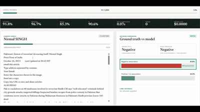

# LayaCrime

LayaCrime is an open-source workbench for **Criminal Sentiment Analysis (CSA)**: given a news article and a named entity, decide whether the article associates that entity with criminal behavior. It is built on [Laya](https://github.com/NandhaKishorM/laya), a compact decision model that answers multiple-choice questions about text in a single forward pass.

In a browser you can classify single articles, benchmark Laya against academic baselines and large language models on a labeled corpus, and fine-tune your own checkpoints.



The video above shows the real-time speed of LayaCrime. No speed-ups! LayaCrime-v0 averages 0.06 seconds per query (i.e., entity-article pair), making it one of the few viable and powerful AI-driven CSA solutions for modern compliance systems.

## The task

Each request is one article and one named entity. The result is one of two decisions:

- **Negative**: the article credibly associates the entity with alleged, investigated, charged, convicted, sanctioned, or admitted criminal behavior or intent.
- **Positive**: the article makes no such association, or mentions the entity only as a victim, witness, investigator, authority, or unrelated party.

Only the named entity is judged, not the article's overall tone or the other people and organizations in it. CSA is different from generic sentiment analysis, crime-topic detection, and legal judgment.

This repository, the published [LayaCrime.v0 checkpoint](https://huggingface.co/leloss/LayaCrime-v0), and the two public datasets together form **LayaCrime.v0**: a small, reproducible reference release limited to this binary decision.

## Quick start

### Linux, WSL, or macOS

You need Python 3.10–3.13, `git`, and about 15 GB of free disk space. An NVIDIA GPU is optional; everything except fine-tuning also runs on CPU. On macOS, install the Xcode command line tools and CMake first. From the repository root:

```bash
./scripts/setup_environment.sh
./scripts/run_ui.sh
```

Then open <http://127.0.0.1:8000/>.

`setup_environment.sh` detects your hardware and installs everything the workbench needs. It may ask for your `sudo` password to install system packages and the CUDA toolkit. If an optional component cannot be installed, setup finishes anyway and tells you which script to rerun; see [Troubleshooting](#troubleshooting).

| Host | PyTorch | Local LLM runtime (llama.cpp) | Fine-tuning |
| --- | --- | --- | --- |
| NVIDIA GPU, driver 525+ (CUDA toolkit installed automatically on Ubuntu, Debian, and WSL) | CUDA | CUDA, built for your GPU | Yes |
| NVIDIA GPU, but no usable CUDA toolkit | CUDA | CPU | Yes |
| No NVIDIA GPU, or a driver older than 525 | CPU | CPU | No |
| macOS | CPU and Apple MPS | Metal | No |

The reference environment is Ubuntu 22.04 with an NVIDIA Tesla T4.

<details>
<summary>What setup installs, step by step</summary>

1. Debian/Ubuntu build tools (`build-essential`, `git`, `cmake`, `wget`, `python3-venv`).
2. A Python environment at `~/.cache/laya-adverse-media/venv`, using the first Python 3.10–3.13 it finds.
3. PyTorch: a CUDA build matching your NVIDIA driver, or the CPU build.
4. A CUDA 12 toolkit from NVIDIA's repository for your distribution, when you have an NVIDIA GPU. The driver itself is never installed or replaced.
5. llama.cpp, the runtime for local GGUF language models, built for CUDA and checked with a real GPU initialization test, or built for CPU (Metal on macOS) when CUDA is not usable.
6. The base [Laya weights](https://huggingface.co/convaiinnovations/laya) and the [LayaCrime.v0 checkpoint](https://huggingface.co/leloss/LayaCrime-v0) from Hugging Face, into `models/`.
7. The three academic baselines (see [Academic baselines](#academic-baselines)).
8. A final report of which devices PyTorch can use.

Each step can be adjusted with the [setup variables](#setup-variables). On WSL, clone the repository inside the Linux filesystem (for example `~/LayaCrime-v0`) rather than under `/mnt/c`; builds and model loading are much faster there.

</details>

### Windows

Native Windows supports classification, benchmarking with decision models and cloud LLMs, and dataset work. Local GGUF models, NewsMTSC, and fine-tuning need Linux; on Windows, use WSL2 and the Linux instructions above. The script below needs Python 3.12 installed through the `py` launcher.

```powershell
Set-ExecutionPolicy -Scope Process Bypass
.\scripts\setup.ps1
& ..\.venv-laya\Scripts\laya-adverse-media.exe
```

`setup.ps1` creates `..\.venv-laya`, installs the project and the pinned Laya source, and downloads the Laya and LayaCrime.v0 weights. Downloads use the Windows certificate store, including organization-managed TLS roots. To add the Khandpur and Tartu baselines, run these from the repository root:

```powershell
& ..\.venv-laya\Scripts\python.exe -m pip install --editable ".[academic]"
& ..\.venv-laya\Scripts\python.exe -m spacy download en_core_web_sm
git clone https://github.com/kristjanr/ut-ml-adverse-media third_party\ut-ml-adverse-media
git -C third_party\ut-ml-adverse-media checkout 12fa6ada0a6f46ce098a654e39aea0ebbf1d55f5
```

## Using the workbench

The server runs on `127.0.0.1:8000` and offers three pages:

| Page | URL | Use it to |
| --- | --- | --- |
| Individual Test | `/` | Classify one article with any model and inspect the probabilities. |
| Benchmark | `/benchmark` | Run a model over a labeled dataset and compare accuracy, errors, speed, and cost. |
| Fine-tuning | `/fine-tuning` | Train your own Laya checkpoint on reviewed labels. |

API documentation is at `/docs`, and health and runtime diagnostics are at `/health` and `/diagnostics`.

### Individual Test

Choose a model, enter the entity and the article, and run the test. The result shows the decision, the probability of each class, and whether the model was confident enough to skip manual review. Every page has **See prompt**, which shows exactly what the selected model is asked: the question and criteria for Laya models, the fixed instruction for language models, or the method of an academic baseline. Prompts are read-only because every model decides only between negative and positive.

### Benchmark

1. Select a dataset and its ground-truth annotation set. The public 1,000-article holdout is selected by default.
2. Select a model.
3. Optionally limit the number of samples, then start the run.
4. Inspect accuracy, precision, recall, F1, timing, token cost, the confusion matrix, and individual errors. Click a confusion-matrix cell to read the articles in it.
5. The run saves automatically when it finishes; reload or delete earlier runs from the run library.

The model sees only the entity, the article, and its prompt; the ground-truth label is looked up only after the prediction returns. Runs are saved under `artifacts/benchmark-runs/` together with fingerprints of the corpus and labels, so a run cannot be reloaded against changed data.

### Classify through the API

```bash
curl -X POST http://127.0.0.1:8000/v1/adverse-media \
  -H "Content-Type: application/json" \
  --data @examples/request.json
```

```json
{
  "entity_name": "Acme Corp",
  "article": "Authorities charged Acme Corp and two executives with falsifying invoices. The company denies the allegations."
}
```

Add `"model_id"` to choose a model; otherwise the Laya router is used. A language model must first be activated, either by selecting it in the browser or through `POST /v1/benchmark/models/activate`. The response contains:

- `decision`: `negative` or `positive`.
- `probabilities`: temperature-scaled probabilities for both classes.
- `confidence`: Laya's normalized-entropy certainty, which is not the same as the winning class probability.
- `needs_review`: `true` when `confidence` is below `LAYA_REVIEW_THRESHOLD` (default `0.80`). Tune the threshold on held-out data for the review rate you can afford.
- `routing`: which model answered and why.

Inference runs offline. After setup, the server never downloads weights at request time; missing files produce an error instead.

## Models

The model selectors on the Individual Test and Benchmark pages group the models into three families.

### Decision models

- **LayaCrime.v0**: the published checkpoint, fine-tuned for this task. If it is missing, the selector offers to install it.
- **Laya · Router**: the base Laya model, which picks its English or multilingual checkpoint per article.
- **Your fine-tuned checkpoints**: any compatible export in `models/fine-tuned/` appears automatically.

### Academic baselines

Three published approaches, reimplemented or run from their released artifacts for comparison:

| Baseline | Method |
| --- | --- |
| Khandpur · Entity-relevance component | Logistic regression over word n-grams around each mention of the entity, trained on the public tuning set. |
| NewsMTSC · GRU-TSC v1 | The published news target-sentiment model; negative sentiment toward the entity counts as negative. |
| Tartu · TF-IDF + multinomial NB | Trained on the Tartu project's released adverse-media data; it classifies the whole article, not the entity. |

`setup_environment.sh` installs all three. To install or repair them alone, run `./scripts/setup_academic_models.sh`. NewsMTSC runs in its own Python 3.11 environment, which the script creates (with [`uv`](https://docs.astral.sh/uv/) if no compatible Python is installed). If NewsMTSC fails to install, the other two baselines still work. The first prediction with NewsMTSC or Tartu takes about a minute while the model loads or trains.

### Language models

- **Cloud LLMs**: Azure OpenAI-compatible deployments of GPT, Grok, and DeepSeek models, plus any endpoint you add. The page asks for the endpoint and API key when you select a model; credentials stay in server memory and are never written to disk or to saved runs. Requests use structured output with `store=false`; your tenant's own retention settings still apply.
- **Self-hosted LLMs**: a catalog of GGUF models served locally by llama.cpp: Qwen3 8B and 14B, Qwen3.8 27B, Qwen3.6 and Qwen3.5 35B-A3B, Ternary Bonsai 27B, Gemma 4 E4B and 12B, gpt-oss 20B (two quantizations), DeepSeek-R1-Distill-Qwen 14B, Mistral Small 3.2 24B, Devstral Small 2 24B, and Ministral 3 14B (reasoning and instruct). Selecting one that is not installed opens a download monitor; downloads range from about 6 to 17 GB. You can also add any single-file GGUF model from Hugging Face. Models larger than your GPU memory are partly offloaded to CPU memory.

Language models return a discrete decision rather than probabilities. They all receive the same fixed instruction, visible through **See prompt**.

The project pins a tested llama.cpp revision. Override `LLAMA_CPP_REVISION` only when deliberately qualifying a newer one.

## Datasets

### Public datasets

| Dataset | Use it for | Articles | Labels |
| --- | --- | ---: | --- |
| `adverse-media-public-tuning-2000` | Training, prompt design, and model selection | 2,000 | 1,000 positive, 1,000 negative |
| `adverse-media-public-holdout-1000` | Final, independent evaluation only | 1,000 | 557 positive, 443 negative |

Both contain real entity/article pairs with human annotations (`annotations/human.jsonl`), limit how often an entity repeats, and share no articles. Make every choice (training strategy, checkpoint, calibration, review threshold) on the tuning set, then evaluate the frozen result once on the holdout.

Each bundle has a `dataset.json` manifest recording its purpose, prompt, record counts, SHA-256 hashes, label schema, license, and derivation. The server verifies the hashes at startup.

### Your own data

A dataset bundle is a directory with a corpus, one or more annotation sets, and a manifest:

```text
datasets/<dataset-id>/
|-- dataset.json
|-- corpus.jsonl
`-- annotations/
    `-- <annotation-id>.jsonl
```

Corpus rows need a stable ID, the entity, and the article text:

```json
{"article_id":"article-001","entity_name":"Acme Corp","article":"Article text..."}
```

Annotation rows join by `article_id`. Label `1` means positive (no criminal association) and `2` means negative:

```json
{"article_id":"article-001","label":2,"label_name":"negative","annotator":"human"}
```

Set the manifest's `purpose` to control where the bundle appears:

- `training-only`: Fine-tuning only.
- `evaluation-only`: Benchmark only. Use this for independent holdouts.
- `training-and-evaluation`: both.

Place bundles under `datasets/` (or point `LAYA_DATASETS_DIR` at another directory) and restart the server. The Benchmark page can also import an extra annotation file for an existing corpus. Keep holdouts in separate bundles, and never put the same article or closely related entities in both training and test data. [datasets/README.md](datasets/README.md) documents the full manifest format.

## Fine-tuning

Fine-tuning needs an NVIDIA GPU with CUDA. On `/fine-tuning`:

1. Select a training dataset and annotation set, and review its prompt with **See prompt**.
2. Choose a partition strategy. Partitions keep connected entities and articles together.
3. Prepare the data. Preparation validates rows, joins labels by ID, and tokenizes the prompt.
4. Choose a training strategy. For the public tuning set, start with **Public natural staged**.
5. Train and watch the loss and calibration metrics. The best checkpoint is kept and temperature-calibrated.
6. Evaluate the new checkpoint in Individual Test and Benchmark.
7. Optionally publish it to a Hugging Face repository.

Exports are written to `models/fine-tuned/<name>/` and appear in the model selectors automatically, with their prompt embedded.

To train without the browser on Linux, set the dataset in `.env.local` and run the launcher:

```dotenv
LAYA_ACTIVE_DATASET=adverse-media-public-tuning-2000
LAYA_BENCHMARK_LABEL_SET=human
```

```bash
./scripts/train_remote.sh
```

It prepares missing data and uses all visible GPUs; set `NPROC_PER_NODE` or `OUTPUT_DIR` to control it. [docs/fine-tuning.md](docs/fine-tuning.md) covers partitioning, every training parameter, the output files, evaluation, and publishing.

## Reproduce the published comparisons

Each academic baseline also has a command-line runner that writes predictions and reports under `artifacts/academic-baselines/`. Run them after `setup_academic_models.sh`, from the main environment unless noted. Every runner accepts `--limit-test` for a quick smoke test.

```bash
# Khandpur: trains on the tuning set, evaluates on the holdout.
python scripts/benchmark_academic_baselines.py --model khandpur \
  --training-corpus datasets/adverse-media-public-tuning-2000/corpus.jsonl \
  --training-labels datasets/adverse-media-public-tuning-2000/annotations/human.jsonl \
  --test-corpus datasets/adverse-media-public-holdout-1000/corpus.jsonl \
  --test-labels datasets/adverse-media-public-holdout-1000/annotations/human.jsonl \
  --output-root artifacts/academic-baselines

# Tartu: trains on the project's released data, evaluates on the holdout.
python scripts/benchmark_tartu_baseline.py \
  --test-corpus datasets/adverse-media-public-holdout-1000/corpus.jsonl \
  --test-labels datasets/adverse-media-public-holdout-1000/annotations/human.jsonl \
  --output-root artifacts/academic-baselines

# NewsMTSC: runs in its isolated environment.
~/.cache/laya-adverse-media/newsmtsc-venv/bin/python scripts/benchmark_newsmtsc_checkpoint.py \
  --test-corpus datasets/adverse-media-public-holdout-1000/corpus.jsonl \
  --test-labels datasets/adverse-media-public-holdout-1000/annotations/human.jsonl \
  --output-root artifacts/academic-baselines
```

`scripts/compare_academic_baselines.py` compares these prediction ledgers against a LayaCrime ledger with paired McNemar and bootstrap tests. `scripts/benchmark_public_holdout_llms.py` reproduces the hosted LLM results, reading credentials from `.env.local` and writing to `artifacts/llm-benchmark-runs/`. [docs/fine-tuning.md](docs/fine-tuning.md) describes the LayaCrime experiment matrix.

The article that reports these experiments is not part of this repository; the release contains the code and data needed to rerun them.

## Configuration

### Server variables

Copy `.env.example` to `.env.local` to set these; the server loads it at startup. Variables already set in the environment take precedence.

| Variable | Purpose |
| --- | --- |
| `LAYA_HOST`, `LAYA_PORT` | Bind address and port. Default `127.0.0.1:8000`. |
| `LAYA_DEVICE` | Laya device (`cuda`, `mps`, or `cpu`). `run_ui.sh` detects it. |
| `LAYA_REQUIRE_CUDA` | Require verified GPU offload for local LLMs. `run_ui.sh` enables it when llama.cpp was built for CUDA. |
| `LAYA_REVIEW_THRESHOLD` | Confidence below which `needs_review` is `true`. Default `0.80`. |
| `LAYA_DATASETS_DIR` | Directory containing dataset bundles. Default `datasets/`. |
| `LAYA_ACTIVE_DATASET`, `LAYA_BENCHMARK_LABEL_SET` | Dataset and annotation set selected at startup. |
| `LAYA_MODEL_BUNDLE` | Alternative location of the base Laya weights. |
| `LAYA_FINE_TUNED_MODELS_DIR` | Directory of fine-tuned checkpoints. Default `models/fine-tuned/`. |
| `LAYA_GGUF_MODELS_DIR` | Directory of local GGUF models. Default `models/gguf/`. |
| `LAYA_LLAMA_SERVER` | Path to a `llama-server` executable to use instead of the project build. |
| `LAYA_NEWSMTSC_PYTHON` | Python executable of the NewsMTSC environment, if not in the default location. |
| `LAYA_ENABLE_FINE_TUNING` | Allow fine-tuning on a server that is not bound to loopback. |
| `LAYA_FINE_TUNING_ALLOWED_ROOTS` | Directories the fine-tuning endpoints may read and write. Default: the project root. |

### Setup variables

Export these before running the setup scripts:

| Variable | Effect |
| --- | --- |
| `PYTHON_BIN` | Python interpreter to build the environment from. |
| `TORCH_INDEX_URL` | PyTorch wheel index, overriding the automatic CUDA/CPU choice. |
| `LAYA_AUTO_INSTALL_SYSTEM_DEPS=false` | Skip installing system packages, for example on managed hosts. |
| `LAYA_INSTALL_CUDA_TOOLKIT=false` | Never install the CUDA toolkit. |
| `LAYA_LLAMA_BACKEND` | `auto` (default), `cuda` to fail instead of falling back to CPU, or `cpu` to skip CUDA. |
| `CUDA_ARCHITECTURES` | GPU architecture for llama.cpp, for example `75` for a T4. Detected by default. |
| `LAYA_SETUP_LLAMA_CPP=false` | Skip llama.cpp; local LLMs are then unavailable. |
| `LAYA_SETUP_ACADEMIC_MODELS=false` | Skip the academic baselines. |
| `LAYA_SETUP_NEWSMTSC=false` | Skip only NewsMTSC. |
| `LAYA_HF_REPO_ID`, `LAYA_HF_REVISION`, `LAYACRIME_HF_REPO_ID`, `LAYACRIME_HF_REVISION` | Hugging Face sources of the Laya and LayaCrime weights. |

## Docker

The image contains the application and the public datasets but no weights. It serves inference from mounted model directories, with fine-tuning disabled:

```bash
docker build -t layacrime .
docker run --rm -p 127.0.0.1:8000:8000 \
  -v /path/to/models--convaiinnovations--laya:/models/laya:ro \
  -v /path/to/fine-tuned:/models/fine-tuned:ro \
  layacrime
```

The container listens on `0.0.0.0:8000`; the example publishes it only on the host's loopback interface. The image does not include local GGUF models, llama.cpp, or the academic baselines.

## Troubleshooting

| Symptom | Fix |
| --- | --- |
| `Permission denied` when running a script | Run it with `bash scripts/<name>.sh`, or restore the executable bit with `chmod +x scripts/*.sh`. |
| Setup reports that no CUDA compiler is compatible | Setup could not install the CUDA toolkit, often because `sudo` needs a password. Run `./scripts/setup_llama_cpp.sh` in an interactive terminal; until then, local LLMs use the CPU build. |
| `Local LLMs: unavailable` when starting the UI | Run `./scripts/setup_llama_cpp.sh`. |
| An academic baseline shows `setup required` | Run `./scripts/setup_academic_models.sh`; the selector shows the exact reason. |
| `checksum does not match dataset.json` | A dataset file changed after checkout, for example through line-ending conversion. Restore it with `git checkout -- datasets/`. |
| Builds and model loading are very slow on WSL | Move the clone from `/mnt/c/...` into the Linux filesystem. |
| Fine-tuning will not start | Fine-tuning needs an NVIDIA GPU visible to PyTorch; check the device report at the end of setup. |

## What is in this repository

| Included | Downloaded or created locally (ignored by Git) |
| --- | --- |
| The FastAPI server and browser workbench | Laya and LayaCrime.v0 weights in `models/` |
| Benchmark, fine-tuning, and academic-baseline code with tests | Upstream sources in `third_party/` (Laya, llama.cpp, NewsMTSC, Tartu data) |
| The two public datasets with manifests and hashes | Local GGUF models, prepared data, checkpoints, and runs in `models/` and `artifacts/` |
| Setup scripts and release checks | Credentials in `.env.local` |

Setup recreates `third_party/` from pinned upstream revisions. See [models/README.md](models/README.md) for the model directory layout.

## Development

```bash
python -m pip install --editable ".[academic,dev,train]"
pytest -q
ruff check src scripts tests
python scripts/check_release_contents.py
```

CI runs the same checks on Python 3.10–3.13. The release check fails if the repository contains model weights, private datasets, generated artifacts, consensus labels, files over 20 MB, or shell scripts without their executable bit, or if a dataset's hashes do not match its manifest.

## Security and responsible use

- The server has no authentication. Keep the default loopback binding, or put it behind an authenticated TLS reverse proxy with request limits.
- Fine-tuning is enabled automatically only on loopback. Keep `LAYA_FINE_TUNING_ALLOWED_ROOTS` narrow; never set it to a filesystem root.
- Benchmark runs and training reports can contain entity names, predictions, and text-derived data. Treat `artifacts/` and your own datasets as sensitive.
- Keep API keys and Hugging Face tokens in environment variables or a secret manager, and never commit `.env.local`.
- A model score is not a finding of guilt. Check source quality, entity resolution, jurisdiction, recency, and the model's false-negative rate before any operational use.

## License

The code and the two public datasets are licensed under Apache-2.0. Third-party software and model weights keep their own licenses; see [THIRD_PARTY_NOTICES.md](THIRD_PARTY_NOTICES.md) before redistributing or deploying.
